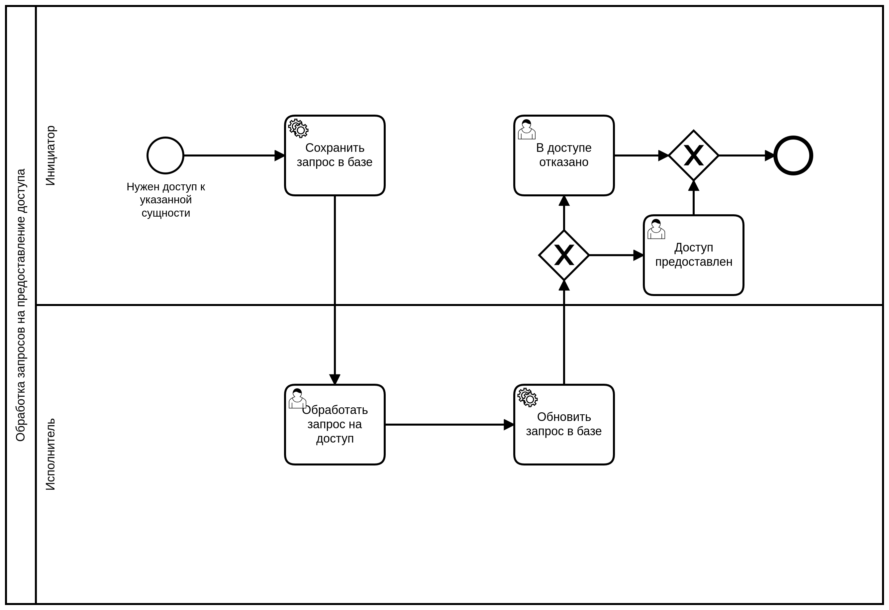

=== Camunda, SpringBootApp, Postgres

*Задача*

Связать Camunda, SpringBootApp, Postgres

==== Бизнес процесс

==== Подготовка
В Postgres создать базу (н.п. camunda_example). Параметры подключения указать в xref:src/main/resources/application.yml[application.yml]

==== Проверка работы

Зайти на http://localhost:8080/ , запустить процесс "Обработка запросов на предоставление доступа". В базе будет таблица с состоянием сущности xref:src/main/java/ru/perm/v/camunda/demo/access/domain/AccessRequest.java[AccessRequest.java]